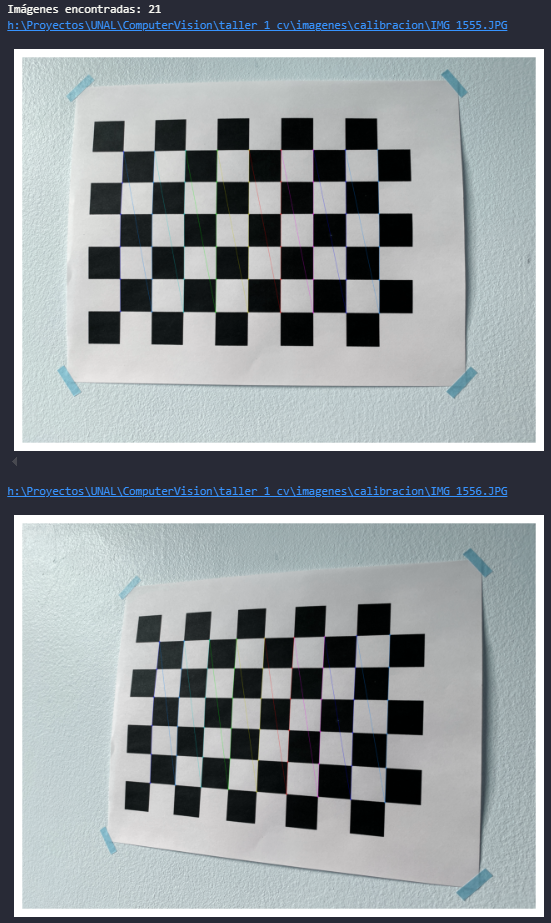
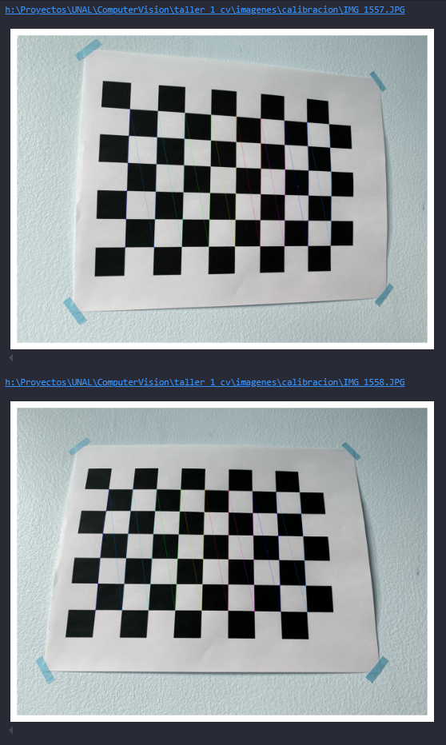
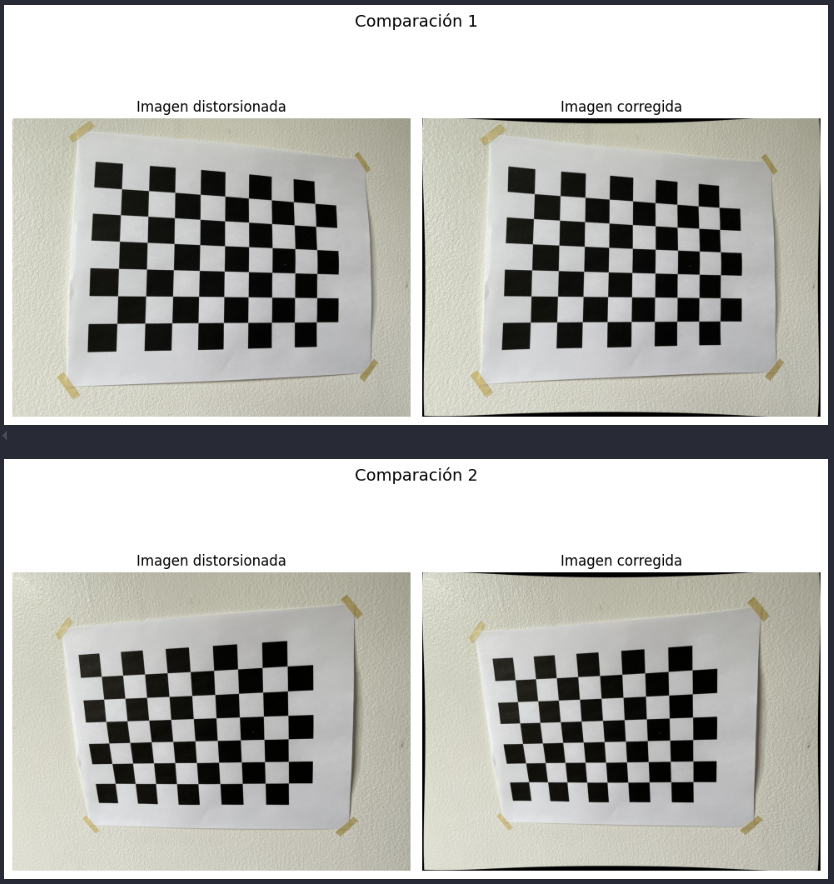
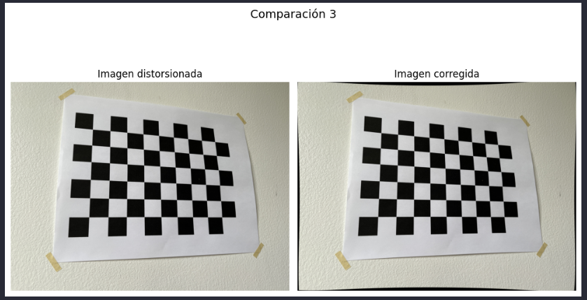
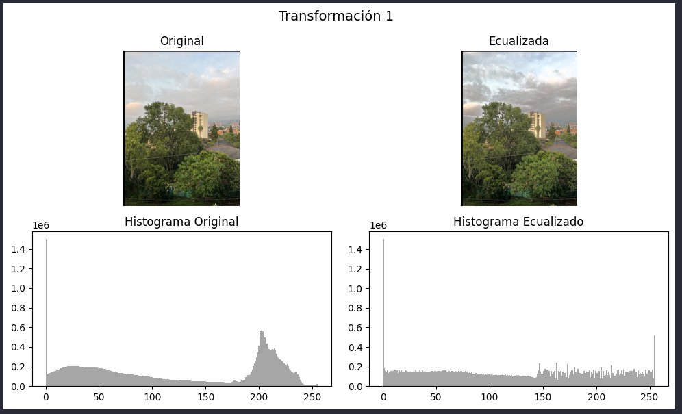
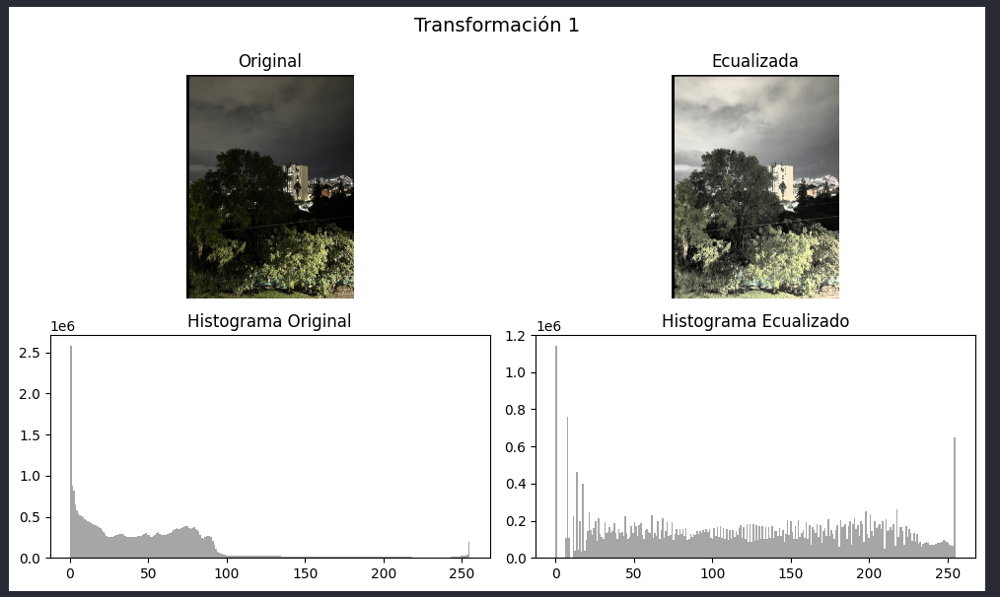
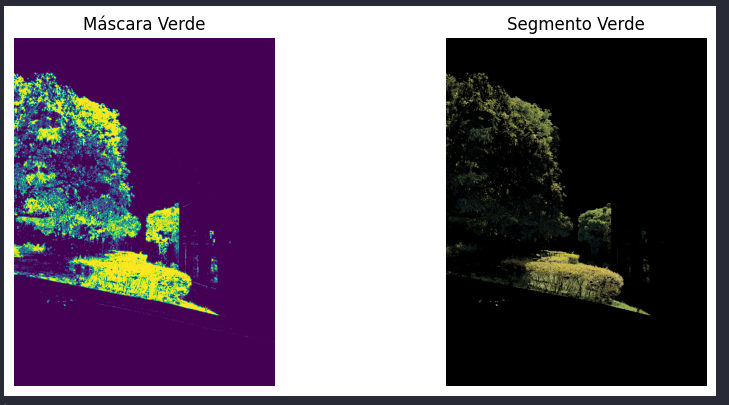

# Taller # 1 de Visión por Computador — Informe

Este trabajo es una práctica experimental en visión por computador y procesamiento digital de imágenes. El objetivo general es aplicar, con datos reales, las operaciones fundamentales que permiten a un sistema de visión interpretar una escena: capturar una imagen, corregirla, transformarla y extraer información cuantitativa.

Todas las imágenes usadas fueron tomadas directamente por el equipo con una cámara de teléfono celular, en distintas condiciones de iluminación y contexto. El procesamiento se desarrolló en Python utilizando librerías de código abierto (OpenCV, NumPy y Matplotlib), y se documentó paso a paso.

## Estructura del informe
- [Fundamentos teóricos](#fundamentos-teoricos)
- [Metodología](#metodología)
- [Resultados & Análisis](#resultados--análisis)
- [Bibliografía](#referencias)

## Fundamentos teóricos

### 1. Planteamiento del problema
La visión por computador busca que las máquinas puedan interpretar y analizar imágenes del mundo real, imitando la forma en que lo hace el ojo humano. Sin embargo, una cámara no siempre captura la escena tal cual es: las imágenes pueden presentar distorsiones ópticas, variaciones de luz o incluso ruido digital que afectan su precisión. Para lograr una representación más fiel, es necesario aplicar procesos matemáticos y computacionales que corrijan esos errores y permitan extraer información útil (Stanford University, 2025).

Un punto clave dentro de este proceso es la calibración de cámara, la cual permite conocer los parámetros intrínsecos y extrínsecos que relacionan los puntos del mundo real (3D) con sus proyecciones en la imagen (2D). Gracias a la calibración, se pueden corregir las distorsiones del lente y mejorar la exactitud en tareas como reconstrucción tridimensional, estimación de movimiento o reconocimiento de objetos (Sadekar, 2020).

### 2. Conceptos principales

#### 2.1. Preprocesamiento
El preprocesamiento busca mejorar la calidad de las imágenes antes de analizarlas. Algunas de las técnicas más comunes son la normalización, la ecualización de histograma y la corrección de distorsiones.

La normalización ajusta los valores de los píxeles dentro de un rango común (por ejemplo, de 0 a 1 o de 0 a 255) para que las diferencias de iluminación o contraste no afecten el desempeño del modelo. Este paso es fundamental en redes neuronales o sistemas de visión, donde la escala de los datos puede cambiar el resultado final (GeeksforGeeks, 2025).

La ecualización de histograma, por otro lado, redistribuye los valores de intensidad de la imagen para mejorar su contraste general. En OpenCV suele aplicarse sobre el canal de luminancia (Y) del espacio YUV, lo que mejora la visibilidad de detalles sin alterar los colores originales (Automatic Addison, 2020).

Finalmente, la corrección geométrica permite eliminar distorsiones del lente como el efecto “barril” o “cojín”. Estos errores ópticos se modelan con coeficientes de distorsión y se corrigen mediante las funciones de calibración de OpenCV (Passolas Fotografías, 2020; Stanford University, 2025).

#### 2.2. Métricas de evaluación
Para medir qué tan bien funciona un modelo o una calibración, se usan diferentes métricas de evaluación. Las más comunes en clasificación son la precisión (Precision), la exhaustividad (Recall) y la F1-score, que combina ambas.

En visión por computador también se usan métricas espaciales como la IoU (Intersección sobre Unión), útil para segmentación, y el MAE (Mean Absolute Error), que mide la diferencia promedio entre valores estimados y reales (GeeksforGeeks, 2025).

Durante este proyecto, el nivel de precisión se evalúa con el error de reproyección RMS,  que mide la diferencia entre los puntos proyectados teóricamente y los observados en la imagen. Según P. Galeone (2018), un error RMS menor a 1 px se considera aceptable, y un valor inferior a 0.5 px corresponde a una calibración de alta calidad.

### 3. Trabajos relacionados
Diversos autores han contribuido al estudio de la calibración y modelado de cámaras. Stanford University (2025) presenta las bases teóricas del modelo pinhole y los fundamentos matemáticos de la proyección 3D–2D. Sadekar (2020) desarrolla una implementación práctica con OpenCV, mientras que GeeksforGeeks (2025) ofrece una guía detallada en Python para calibrar y validar resultados. Automatic Addison (2020) complementa con ejemplos aplicados a robótica móvil.

Además, Galeone (2018) propone buenas prácticas para minimizar errores de calibración, Kumar (2025) profundiza en la interpretación geométrica de los parámetros de proyección, y Passolas Fotografías (2020) ilustra visualmente los tipos de distorsión y sus correcciones.

## Metodología

El trabajo se desarrolló como una práctica experimental de visión por computador utilizando imágenes reales capturadas por el equipo y procesadas en Python con OpenCV, NumPy y Matplotlib. Se estructuró en cinco etapas: calibración de cámara, transformaciones de intensidad, transformaciones geométricas, ecualización de histograma y segmentación por color.

### 1. Calibración de la cámara
Se tomaron múltiples imágenes de un tablero de ajedrez desde distintas posiciones. Para cada imagen se detectaron esquinas internas con cv2.findChessboardCorners, se refinaron subpíxel con cv2.cornerSubPix, y se emparejaron con sus coordenadas reales. Con todos los pares 2D↔3D se estimaron los parámetros intrínsecos (matriz K), los coeficientes de distorsión radial y tangencial y los parámetros extrínsecos (rotación y traslación) mediante cv2.calibrateCamera. Se registró el error RMS de reproyección como métrica de calidad y se generaron imágenes corregidas (sin distorsión) para comparar visualmente el efecto, sobre todo en los bordes.

### 2. Transformaciones de intensidad a nivel de píxel
Se capturaron dos fotografías de la misma fachada, una de día (≈6 a. m.) y otra de noche (≈7 p. m.), desde el mismo punto. Sobre estas imágenes se implementaron manualmente operaciones de brillo (suma constante), contraste (escalamiento respecto a la media) y corrección gamma (ajuste no lineal de luminancia). También se realizaron combinaciones punto a punto entre ambas imágenes: suma, resta, multiplicación y división, controlando saturación y divisiones por cero. Esto permitió observar diferencias de iluminación y pérdida de detalle entre ambas condiciones. 

### 3. Transformaciones geométricas
Se definió una función que cargó una imagen base y aplicó en secuencia varias transformaciones afines: traslaciones, rotaciones alrededor del centro y escalamiento. Después de cada transformación se guardó el fotograma intermedio. Con esos fotogramas se construyó una animación (GIF/HTML) para visualizar de forma continua la evolución espacial de la imagen.

### 4. Ecualización de histograma
Se analizaron las imágenes de fachada día/noche en términos de distribución de intensidades. Cada imagen se pasó a espacio YUV y se aplicó ecualización de histograma sobre el canal Y (luminancia). Luego se reconstruyó la imagen en RGB y se compararon histogramas antes y después. Esto permitió evaluar cómo la ecualización mejora contraste global, especialmente en condiciones nocturnas.

### 5. Segmentación y conteo por color
Se capturó una escena con varios objetos de colores distintos. La imagen se convirtió a HSV y se definieron rangos de color (H, S, V) para cada categoría. Con cv2.inRange se generaron máscaras binarias por color y luego se aplicaron operaciones morfológicas para limpiar ruido. Finalmente, se extrajeron contornos, se dibujaron sobre la imagen original y se calculó tanto el número de objetos de cada color como el área aproximada (en píxeles) de cada objeto.

## Resultados & Análisis

### 1. Calibración de la cámara
En la Figuras 1 y 2 se muestran varias imágenes del patrón de calibración (tablero de ajedrez) con las esquinas correctamente detectadas y dibujadas usando cv2.findChessboardCorners y cv2.drawChessboardCorners. Esto confirma que el patrón fue reconocido de forma consistente en múltiples poses.

A partir de estos puntos 2D–3D se estimaron los parámetros intrínsecos de la cámara. La matriz K obtenida fue:

$$\begin{bmatrix}
3081.44 & 0 & 1984.29\\
0 & 3098.68 & 1524.75\\
0 & 0 & 1
\end{bmatrix}$$

Los valores focales $f_x=3081.44$ y $f_y=3098.68$ son muy similares (diferencia $≈ 0.5$ %), lo que indica que los píxeles del sensor son casi cuadrados y no hay deformación marcada en un eje específico.

El punto principal $(cx, cy)=(1984.3, 1524.8)$ está cerca del centro geométrico de la imagen $(2016.0, 1512.0)$; la distancia entre ambos es de $~34.2$ px, equivalente a $1.57$ % en $x$ y $–0.84$ % en $y$. Esto sugiere que el eje óptico está bien alineado con el sensor y que no hubo desplazamientos severos de la lente.

Los coeficientes de distorsión estimados fueron:
* $k_1=0.0513$
* $k_2=–0.5059$
* $p_1=0.0045$
* $p_2=-0.0028$
* $k_3=0.4909$

El signo de $k_2$ y la forma visual observada en los bordes indican una distorsión tipo cojín (pincushion), donde las líneas rectas tienden a curvarse hacia adentro en las esquinas (Figuras 3 y 4).

El error medio de reproyección fue de $0.47$ píxeles. Este valor es bajo y confirma que el ajuste geométrico entre el modelo de cámara y las observaciones reales es consistente. En la Figura 3 se comparan imágenes originales y sus versiones corregidas con cv2.undistort, donde se aprecia que las líneas cercanas al borde se enderezan después de la corrección.

### 2. Transformaciones de intensidad
Se tomaron dos fotografías de la misma fachada, una en condiciones de luz diurna (~6 a. m.) y otra nocturna (~7 p. m.). Sobre esas dos imágenes se aplicaron tres operaciones punto a punto implementadas manualmente:

* Ajuste de brillo: suma constante a cada canal RGB para aclarar u oscurecer la imagen saturando a $[0,255]$.

* Ajuste de contraste: escalamiento alrededor de la media para intensificar diferencias locales.

* Corrección gamma: remapeo no lineal $(𝐼^′=𝐼^𝛾)$ que aclara sombras $(γ<1)$ o comprime altas luces $(γ>1)$.

En la Figura 4 se observan cuatro paneles: imagen diurna original, imagen nocturna original, imagen diurna tras corrección gamma y la misma operación sobre la imagen nocturna. Se evidencia que la corrección gamma mejora especialmente la imagen nocturna, recuperando detalle en regiones oscuras sin sobreexponer completamente las zonas iluminadas.

Adicionalmente, se realizaron combinaciones aritméticas entre la imagen de día $(A)$ y la de noche $(B)$: $A+B$, $A−B$, $A×B$ y $A÷B$ (Figura 5).

* La suma resalta zonas iluminadas en cualquiera de las dos tomas.

* La resta permite identificar áreas donde cambió la iluminación entre día y noche (por ejemplo, luces artificiales).

* La multiplicación enfatiza solo las regiones que son simultáneamente brillantes en ambas imágenes.

* La división resalta regiones iluminadas en una toma pero no en la otra, útil para detectar focos de luz nocturna.

### 3. Transformaciones geométricas y animación
Se definió una rutina que carga una imagen base y aplica, en secuencia, varias transformaciones geométricas afines: traslaciones (desplazamientos en x/y), rotaciones alrededor del centro de la imagen y cambios de escala (zoom in / zoom out). Después de cada transformación parcial se guardó el fotograma resultante.

Con esta lista de fotogramas se generó una animación tipo GIF usando matplotlib.animation.FuncAnimation. El resultado (ver Figura 5) muestra la imagen “moviéndose”, rotando y cambiando de tamaño cuadro a cuadro, lo que demuestra que las transformaciones sucesivas se aplicaron en el orden correcto y producen un movimiento continuo.

### 4. Limitaciones observadas
Se analizaron las dos imágenes de fachada (día y noche) en términos de su distribución de intensidades. Cada imagen se transformó a espacio YUV y se aplicó ecualización de histograma únicamente sobre el canal Y (luminancia), usando cv2.equalizeHist. Luego se reconstruyó la imagen en RGB.

En las Figuras 6 y 7 se presentan, para cada caso (día y noche):

1. Imagen original.

2. Imagen ecualizada.

3. Histograma original de intensidades.

4. Histograma ecualizado.

Resultados principales:

* En la imagen nocturna, el histograma original está concentrado en valores bajos (oscuros). Tras la ecualización, el histograma se distribuye de forma más uniforme y aparecen detalles que antes estaban casi negros.

* En la imagen diurna ocurre lo contrario: había saturación en zonas muy brillantes. La ecualización reduce ese pico y mejora el contraste en regiones claras.

*Conclusión:* la ecualización mejora la legibilidad visual tanto en baja iluminación (recuperando sombras) como en alta iluminación (recuperando textura en zonas casi blancas).

### 5. Segmentación y conteo por color
Se capturó una escena con múltiples objetos de colores distintos (por ejemplo, superficies azules, verdes, grises, blancas). La imagen se convirtió a espacio HSV y para cada color se definieron rangos $[H_{min}, S_{min}, V_{min}] – [H_{max}, S_{max}, V_{max}]$. Con esos rangos se generaron máscaras binarias (cv2.inRange), que luego se limpiaron con operaciones morfológicas para reducir ruido.

Posteriormente se extrajeron contornos con cv2.findContours, se dibujaron sobre la imagen original y se calculó:

* El número total de objetos detectados por color.

* El área aproximada de cada objeto, en píxeles, usando cv2.contourArea.

En la Figura 8 se muestra, para un color específico (verde):

* Imagen original.

* Máscara binaria limpia.

## Referencias bibliográficas

* Automatic Addison. (2020, diciembre 5). How to Perform Camera Calibration Using OpenCV. https://automaticaddison.com/how-to-perform-camera-calibration-using-opencv/
* Galeone, P. (2018, marzo 4). Camera Calibration Guidelines. https://pgaleone.eu/computer-vision/2018/03/04/camera-calibration-guidelines/
* GeeksforGeeks. (2025). Camera Calibration with Python OpenCV. https://www.geeksforgeeks.org/python/camera-calibration-with-python-opencv/
* Kumar, P. (2025, enero 29). A Comprehensive Guide to Understand Camera Projection and Parameters. e-con Systems. https://www.e-consystems.com/blog/camera/technology/a-comprehensive-guide-to-understand-camera-projection-and-parameters/
* Passolas Fotografías. (2020, enero 11). Distorsiones de lente, qué son y cómo solucionarlas – Adobe Lightroom [Video]. YouTube. https://www.youtube.com/watch?v=vVW2EeL-uQQ
* Sadekar, K. (2020, febrero 25). Camera Calibration using OpenCV. LearnOpenCV. https://learnopencv.com/camera-calibration-using-opencv/
* Stanford University. (2025). Camera Models – CS231A: Computer Vision, From 3D Reconstruction to Recognition. https://web.stanford.edu/class/cs231a/course_notes/01-camera-models.pdf