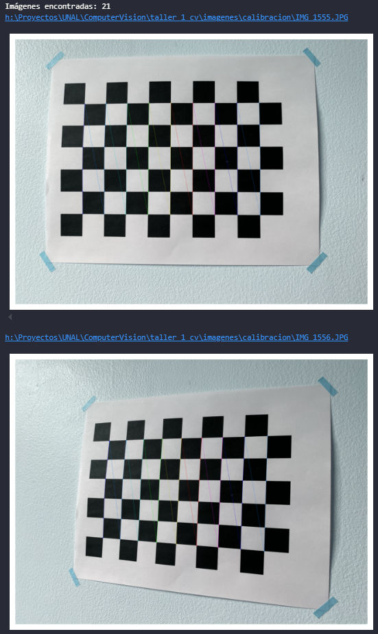
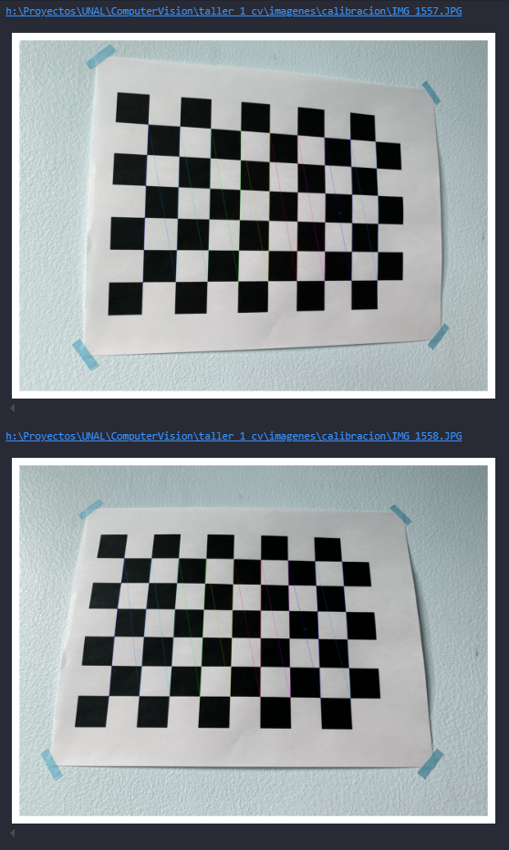
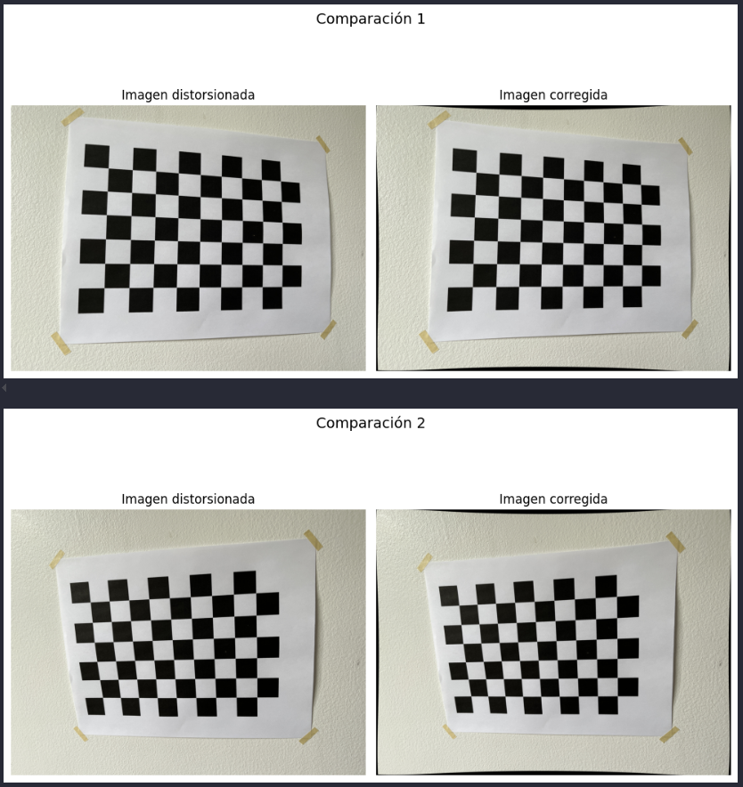
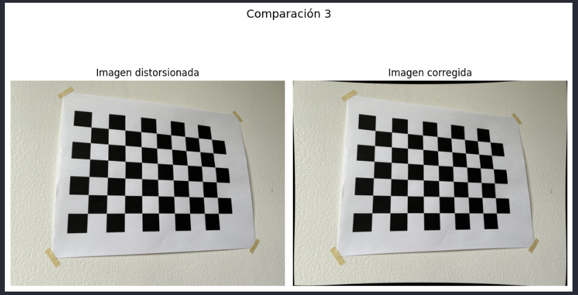

# Resultados & Análisis

## 1. Calibración de la cámara
En la Figuras 1 y 2 se muestran varias imágenes del patrón de calibración (tablero de ajedrez) con las esquinas correctamente detectadas y dibujadas usando cv2.findChessboardCorners y cv2.drawChessboardCorners. Esto confirma que el patrón fue reconocido de forma consistente en múltiples poses.

A partir de estos puntos 2D–3D se estimaron los parámetros intrínsecos de la cámara. La matriz K obtenida fue:

$$\begin{bmatrix}
3081.44 & 0 & 1984.29\\
0 & 3098.68 & 1524.75\\
0 & 0 & 1
\end{bmatrix}$$

Los valores focales $f_x=3081.44$ y $f_y=3098.68$ son muy similares (diferencia $≈ 0.5$ %), lo que indica que los píxeles del sensor son casi cuadrados y no hay deformación marcada en un eje específico.

El punto principal $(cx, cy)=(1984.3, 1524.8)$ está cerca del centro geométrico de la imagen $(2016.0, 1512.0)$; la distancia entre ambos es de $~34.2$ px, equivalente a $1.57$ % en $x$ y $–0.84$ % en $y$. Esto sugiere que el eje óptico está bien alineado con el sensor y que no hubo desplazamientos severos de la lente.

Los coeficientes de distorsión estimados fueron:
* $k_1=0.0513$
* $k_2=–0.5059$
* $p_1=0.0045$
* $p_2=-0.0028$
* $k_3=0.4909$

El signo de $k_2$ y la forma visual observada en los bordes indican una distorsión tipo cojín (pincushion), donde las líneas rectas tienden a curvarse hacia adentro en las esquinas (Figuras 3 y 4).

El error medio de reproyección fue de $0.47$ píxeles. Este valor es bajo y confirma que el ajuste geométrico entre el modelo de cámara y las observaciones reales es consistente. En la Figura 3 se comparan imágenes originales y sus versiones corregidas con cv2.undistort, donde se aprecia que las líneas cercanas al borde se enderezan después de la corrección.

## 2. Transformaciones de intensidad
Se tomaron dos fotografías de la misma fachada, una en condiciones de luz diurna (~6 a. m.) y otra nocturna (~7 p. m.). Sobre esas dos imágenes se aplicaron tres operaciones punto a punto implementadas manualmente:

* Ajuste de brillo: suma constante a cada canal RGB para aclarar u oscurecer la imagen saturando a $[0,255]$.

* Ajuste de contraste: escalamiento alrededor de la media para intensificar diferencias locales.

* Corrección gamma: remapeo no lineal $(𝐼^′=𝐼^𝛾)$ que aclara sombras $(γ<1)$ o comprime altas luces $(γ>1)$.

En la Figura 4 se observan cuatro paneles: imagen diurna original, imagen nocturna original, imagen diurna tras corrección gamma y la misma operación sobre la imagen nocturna. Se evidencia que la corrección gamma mejora especialmente la imagen nocturna, recuperando detalle en regiones oscuras sin sobreexponer completamente las zonas iluminadas.

Adicionalmente, se realizaron combinaciones aritméticas entre la imagen de día $(A)$ y la de noche $(B)$: $A+B$, $A−B$, $A×B$ y $A÷B$ (Figura 5).

* La suma resalta zonas iluminadas en cualquiera de las dos tomas.

* La resta permite identificar áreas donde cambió la iluminación entre día y noche (por ejemplo, luces artificiales).

* La multiplicación enfatiza solo las regiones que son simultáneamente brillantes en ambas imágenes.

* La división resalta regiones iluminadas en una toma pero no en la otra, útil para detectar focos de luz nocturna.

## 3. Transformaciones geométricas y animación
Se definió una rutina que carga una imagen base y aplica, en secuencia, varias transformaciones geométricas afines: traslaciones (desplazamientos en x/y), rotaciones alrededor del centro de la imagen y cambios de escala (zoom in / zoom out). Después de cada transformación parcial se guardó el fotograma resultante.

Con esta lista de fotogramas se generó una animación tipo GIF usando matplotlib.animation.FuncAnimation. El resultado (ver Figura 5) muestra la imagen “moviéndose”, rotando y cambiando de tamaño cuadro a cuadro, lo que demuestra que las transformaciones sucesivas se aplicaron en el orden correcto y producen un movimiento continuo.

## 4. Limitaciones observadas
Se analizaron las dos imágenes de fachada (día y noche) en términos de su distribución de intensidades. Cada imagen se transformó a espacio YUV y se aplicó ecualización de histograma únicamente sobre el canal Y (luminancia), usando cv2.equalizeHist. Luego se reconstruyó la imagen en RGB.

En las Figuras 6 y 7 se presentan, para cada caso (día y noche):

1. Imagen original.

2. Imagen ecualizada.

3. Histograma original de intensidades.

4. Histograma ecualizado.

Resultados principales:

* En la imagen nocturna, el histograma original está concentrado en valores bajos (oscuros). Tras la ecualización, el histograma se distribuye de forma más uniforme y aparecen detalles que antes estaban casi negros.

* En la imagen diurna ocurre lo contrario: había saturación en zonas muy brillantes. La ecualización reduce ese pico y mejora el contraste en regiones claras.

*Conclusión:* la ecualización mejora la legibilidad visual tanto en baja iluminación (recuperando sombras) como en alta iluminación (recuperando textura en zonas casi blancas).

## 5. Segmentación y conteo por color
Se capturó una escena con múltiples objetos de colores distintos (por ejemplo, superficies azules, verdes, grises, blancas). La imagen se convirtió a espacio HSV y para cada color se definieron rangos $[H_{min}, S_{min}, V_{min}] – [H_{max}, S_{max}, V_{max}]$. Con esos rangos se generaron máscaras binarias (cv2.inRange), que luego se limpiaron con operaciones morfológicas para reducir ruido.

Posteriormente se extrajeron contornos con cv2.findContours, se dibujaron sobre la imagen original y se calculó:

* El número total de objetos detectados por color.

* El área aproximada de cada objeto, en píxeles, usando cv2.contourArea.

En la Figura 7 se muestra, para un color específico (por ejemplo, azul):

* Imagen original.

* Máscara binaria limpia.

* Contornos sobrepuestos y etiquetados.